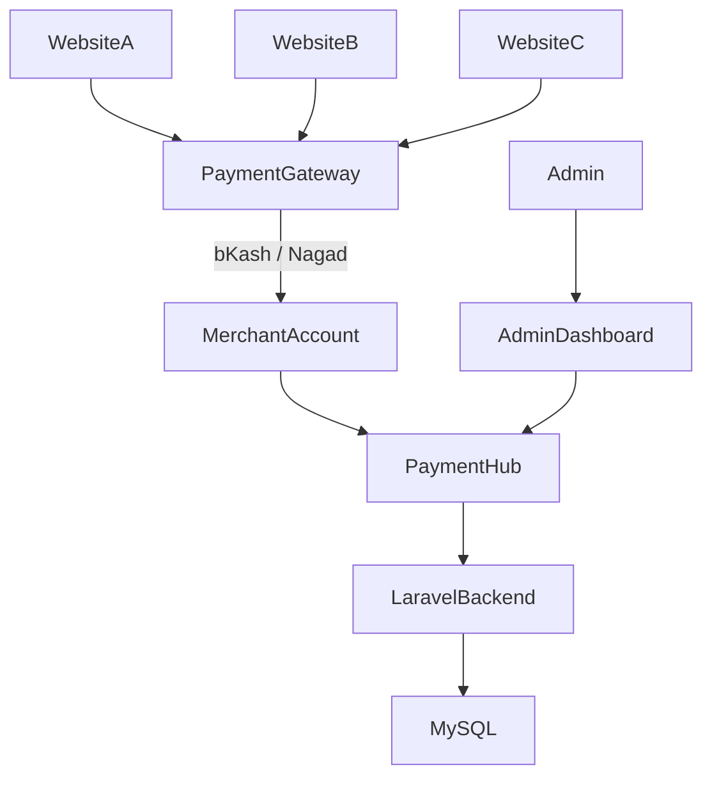

# PaymentHub – Centralized Payment Monitoring Platform

PaymentHub is a centralized platform designed to monitor and manage payments from multiple websites through a single dashboard.

Even though payments are received through the same **bKash and Nagad accounts**, the system tracks and categorizes transactions based on different merchant accounts.

---

## Features

### Centralized Payment Dashboard

Monitor payment activity from multiple websites.

- Total payment tracking
- Real-time transaction monitoring
- Revenue analytics charts
- Payment reports

---

### Multi Website Merchant Accounts

Each website can have its own merchant account.

Example:

Website A → Merchant A  
Website B → Merchant B  
Website C → Merchant C  

---

### Payment Gateway Integration

Supported gateways:

- bKash
- Nagad

---

### Transaction Reports

- Daily payment reports
- Monthly analytics
- Gateway distribution
- Transaction history

---

### Settlement Management

- Merchant settlement tracking
- Payment reconciliation

---

### Refund System

Admins can process refunds for transactions.

---

## System Architecture

---

# Tech Stack

Backend
- Laravel
-	PHP

Database
-	MySQL

Payments
-	bKash API
-	Nagad API

---

# Author

Md Atikur Rahman

Full Stack Developer

GitHub: https://github.com/atikurrahman1587

LinkedIn: https://www.linkedin.com/in/atikurrahman1587 
